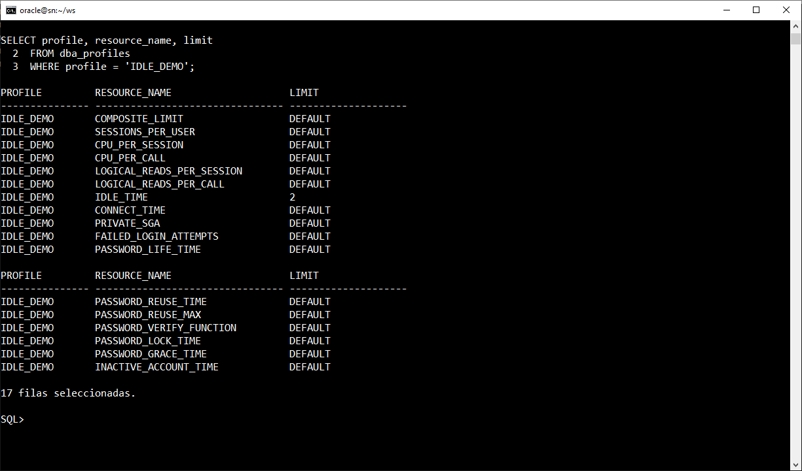
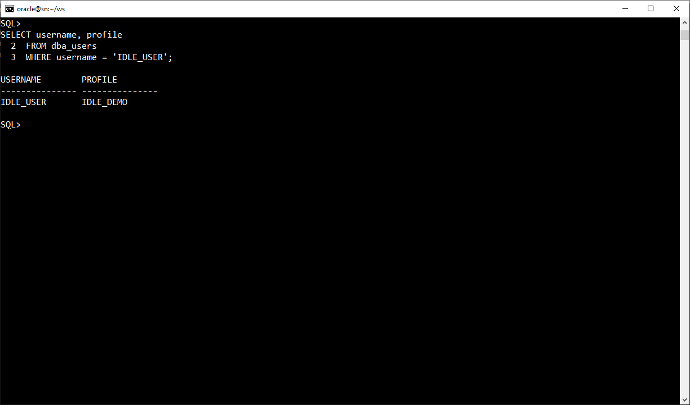
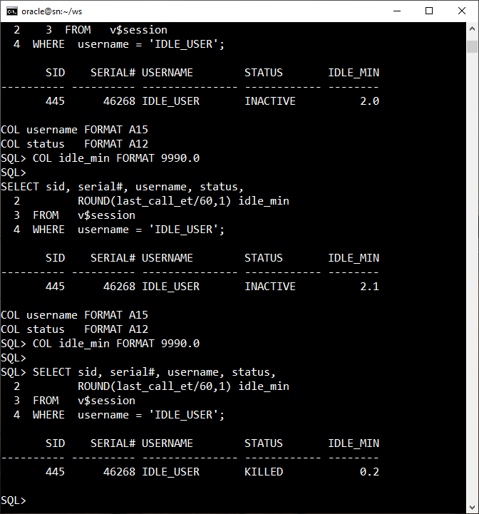
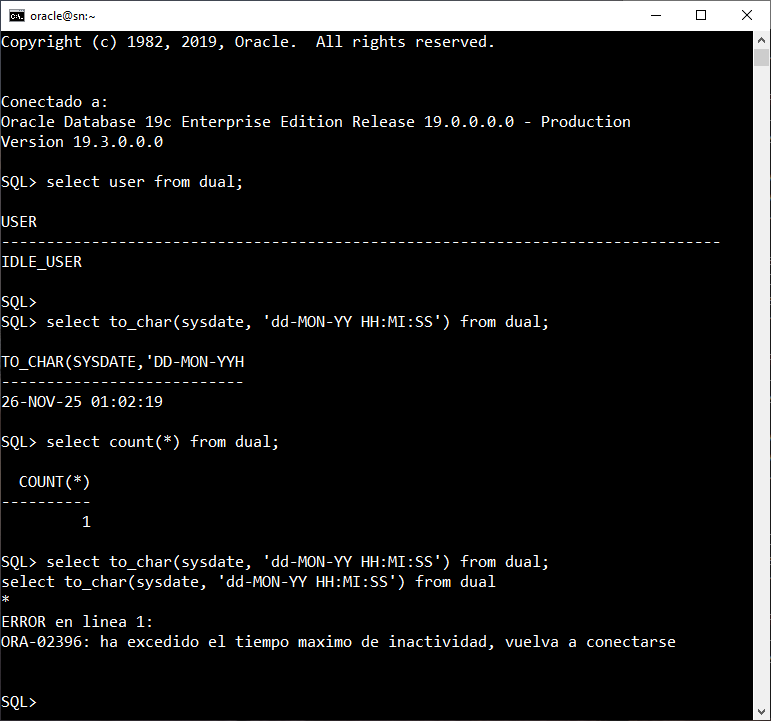
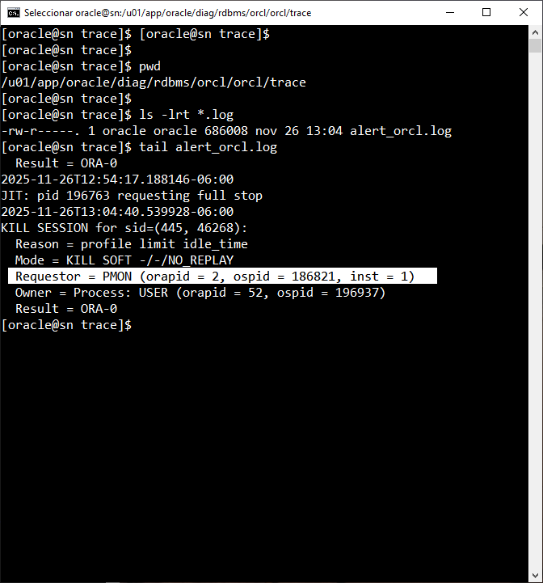

# DEMO 4.3 Terminación de Sesión por IDLE_TIME y PMON en acción


## Tarea 1. LABORES DE LIMPIEZA (como SYS)

Aseguramos que no existan restos previos.

```sh
# orcl o una base de datos válidas
. oraenv

# Conectarse como SYS
sqlplus sys/Oracle1 as sysdba

```

```sql

-- Eliminar usuario si existe
DROP USER idle_user CASCADE;

-- Eliminar profile si existe
DROP PROFILE idle_demo;
```

> **Nota: Ignora errores si no existían**

<br/><br/>

### Tarea 2. HABILITAR ENFORCEMENT DE RECURSOS

El parámetro `RESOURCE_LIMIT` debe estar en TRUE para que IDLE_TIME funcione.

```sql
SHOW PARAMETER resource_limit;

ALTER SYSTEM SET resource_limit = TRUE SCOPE=BOTH;

-- ¿Qué tipo de parametro es resource_limit?
-- Booleano (TRUE/FLASE)
-- Dinámico 

SELECT name, value, isses_modifiable, issys_modifiable
FROM   v$parameter
WHERE  name = 'resource_limit';
```

<br/><br/>

### Tarea 3. CREAR EL PROFILE CON IDLE_TIME REDUCIDO

Los valores son en minutos

```sql

-- tiempo máximo de inactividad (minutos)

CREATE PROFILE idle_demo LIMIT 
  IDLE_TIME 2;   
```

Verificar:

```sql
SELECT profile, resource_name, limit
FROM dba_profiles
WHERE profile = 'IDLE_DEMO';
```


<br/><br/>

### Tarea 4. CREACIÓN DEL USUARIO Y ASIGNACIÓN DEL PROFILE

```sql

CREATE USER idle_user IDENTIFIED BY Idle_123
  PROFILE idle_demo
  DEFAULT TABLESPACE users
  TEMPORARY TABLESPACE temp
  QUOTA 5M ON users;

GRANT CREATE SESSION TO idle_user;
```

Verificar:

```sql
set linesize 200
col username format a20
col profile format a20
SELECT username, profile FROM dba_users WHERE username = 'IDLE_USER';
```

<br/><br/>

### Tarea 5. CONEXIÓN DEL USUARIO en otra terminal

Abrir una nueva ventana/terminal:

```sql
sqlplus idle_user/Idle_123

```

Probar actividad:

```sql
SHOW USER
SELECT USER FROM dual;
SELECT TO_CHAR(SYSDATE, 'YYYY-MON-DD HH:MM:SS') FROM dual;
```

Dejar esta ventana **inactiva**.

<br/><br/>

### Tarea 6. MONITOREO DESDE EL DBA (ventana SYS)

Mientras el usuario está inactivo, monitoreamos su estado

```sql
SET LINESIZE 200
COL username FORMAT A15
COL status   FORMAT A12
COL idle_min FORMAT 9990.0

SELECT sid, serial#, username, status, ROUND(last_call_et/60,1) idle_min
FROM   v$session
WHERE  username = 'IDLE_USER';

-- ACTIVE -> KILLED

```

<br/><br/>

### 7. PRUEBA DEL LADO DEL USUARIO (ventana IDLE_USER)

Después de 2–4 minutos inactivo, ejecutar:

```sql

SELECT SYSDATE FROM dual;

```

> **Nota:** `ORA-02396: exceeded maximum idle time, please connect again`


<br/><br/>

### Tarea 8. REVISIÓN DE TRAZAS PARA VER QUE PMON MATÓ LA SESIÓN

En terminal del servidor (OS):

```bash
cd $ORACLE_BASE/diag/rdbms/*/*/trace
ls -lrt  *.trc
tail alert_orcl.log
```


>> Interpretación rápida:

* **Reason = profile limit idle_time** → Causa exacta
* **Mode = KILL SOFT** → Terminado suavemente
* **Requestor = PMON** → *PMON es quien mata la sesión*
* **Result = ORA-0** → éxito total

Esta es la **prueba irrefutable**.

<br/><br/>

### Tarea 9. LIMPIEZA FINAL (opcional)

```sql
DROP USER idle_user CASCADE;
DROP PROFILE idle_demo;
```

<br/><br/>

## Resultado esperado




<br/><br/>



<br/><br/>



<br/><br/>



<br/><br/>

